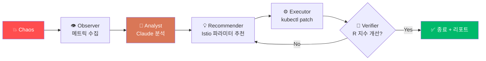

<div align="center">

# 🧪 ChaosLab

### **AI-Powered Chaos Engineering Dashboard**

**GitOps 배포 → 카오스 주입 → 실시간 모니터링 → R 지수 시각화 → AI 자동 개선**
KuardianAngelRing 파이프라인의 컨트롤 플레인 (FastAPI 단일 프로세스)

[](https://www.python.org/)
[](https://fastapi.tiangolo.com/)
[](https://htmx.org/)
[](https://alpinejs.dev/)
[](https://www.chartjs.org/)
[](https://www.sqlite.org/)
[](https://www.anthropic.com/)

[**🚀 Quick Start**](#-quick-start) ·
[**🏗️ Architecture**](#%EF%B8%8F-architecture) ·
[**📺 Pages**](#-pages) ·
[**🧩 Features**](#-features) ·
[**🗺️ Roadmap**](#%EF%B8%8F-roadmap)

> ✅ **상태**: Slice 1 (걷는 뼈대) 구현 완료 — 6페이지 + HTMX 네비 + SQLite/seed + 외부 스텁 + SSE. (`pytest` 19 통과)
> 인프라(EKS · Chaos Mesh · 모니터링)는 별도 레포 [**Iac-aws**](../Iac-aws) 참조.

</div>

---

## 🧭 What is ChaosLab?

ChaosLab은 **KuardianAngelRing** 졸업과제의 3-레포 구조에서 **대시보드 + AI 루프**를 담당합니다.
EC2 위에서 **단일 FastAPI 프로세스**로 돌며, EKS 클러스터에 카오스를 주입하고 메트릭을 모아 보여주고, 결과를 AI가 해석해 Istio 파라미터를 자동 개선합니다.

| 레포 | 역할 | 실행 위치 |
|------|------|----------|
| [**Iac-aws**](../Iac-aws) | Terraform 인프라 + GitOps 매니페스트 | EC2 |
| **`chaoslab`** (이 레포) | 대시보드(FastAPI) + AI 루프 | EC2 |
| 사용자 앱 레포들 | GitOps로 배포되는 카오스 테스트 대상(SUT) | EKS |

---

## 🏗️ Architecture

```
┌────────────────────────────────────────────────────┐
│  EC2 — 단일 FastAPI 프로세스                          │
│   • Jinja + HTMX + Alpine UI                         │
│   • 라이브 갱신 → FastAPI SSE                          │
│   • AI 루프 = asyncio 백그라운드 (Phase 3)             │
│   • SQLite (로컬 파일) — apps / builds / exp / iter     │
│   • 외부 시스템 = Protocol 인터페이스 + 구현 (stub→real) │
└──────────┬───────────────────────────────────────────┘
           │ kubernetes-py / port-forward
           ▼
     EKS 클러스터
     • Chaos Mesh CRD · Argo Workflows/Kaniko · Istio patch
     • Prometheus (9090) · Loki (3100)
```

**설계 원칙** — 외부 시스템(빌더 · 카오스 · 모니터링 · K8s)은 모두 `Protocol` 인터페이스 뒤에 둔다.
라우터는 인터페이스에만 의존하므로(DIP), 스텁 → 실제 구현 교체 시 상위 코드는 바뀌지 않는다.
우리가 소유한 데이터는 SQLite + Repository 패턴으로 관리한다. **최소한·중복 없이·리팩토링 친화적**.

---

## 🤖 AI Loop (Phase 3)

카오스가 주입되면 AI 에이전트들이 협력해 회복탄력성을 자동으로 끌어올립니다.

<div align="center">



</div>

```
R 지수 = 0.4 × 가용성 + 0.3 × 레이턴시 점수 + 0.3 × 복구 속도
```

---

## 🛠️ Tech Stack

<div align="center">

| Layer | Technology |
|---|---|
| **🐍 Runtime** | Python 3.12, FastAPI, Uvicorn, asyncio |
| **🎨 UI** | Jinja2 + HTMX (부분 갱신/SSE) + Alpine.js (탭·모달·테마) + Chart.js |
| **💅 Design** | Tailwind (CDN) + TDS 디자인 토큰 (CSS 변수, light/dark) |
| **💾 Database** | SQLite (단일 파일, 경량) + Repository 패턴 |
| **☸️  K8s 연동** | kubernetes-py, port-forward (Prometheus/Loki) |
| **🚀 GitOps/Build** | Argo Workflows + Kaniko + ECR + ArgoCD |
| **🤖 AI** | Anthropic Claude (Sonnet 4.6) |

</div>

---

## 📁 Repository Structure

```
chaoslab/
├── app/
│   ├── main.py · config.py · deps.py · rendering.py
│   ├── routers/      # pages · apps · experiments · stream(SSE) · webhook
│   ├── services/     # interfaces(Protocol) · stubs · agent/(Phase 3)
│   ├── db/           # database · models · repositories · seed
│   ├── templates/    # base.html · partials/ · macros/ · pages/
│   └── static/       # css/tds.css · js/app.js
├── tests/
├── docs/             # 설계 문서 (로컬 보관)
├── requirements.txt · .env.example
```

---

## 📺 Pages

| 라우트 | 핵심 | 라이브 |
|--------|------|:---:|
| `/` 대시보드 | KPI 4 + 진행중 실험 + AI 분석 요약 + 최근 활동 + 시스템 상태 | SSE |
| `/apps` | 앱 카드 + 새 앱 모달 → 빌드/배포 | SSE |
| `/experiments` | 실험 목록(필터/페이지) + 새 실험 모달 | SSE |
| `/experiments/{id}` | 5탭: 개요 · 메트릭(RED) · AI 루프 · 개선 포인트 · 로그 | SSE |
| `/infra` | 클러스터/노드/컴포넌트 **조회만** | 폴링 |
| `/settings` | AI 설정 + 외부 통합 키 | — |

---

## 🧩 Features

| 블록 | 내용 |
|------|------|
| **A. 빌드/배포** | git URL + 프레임워크 → Dockerfile → Kaniko 빌드 → ECR → 이미지태그 patch → ArgoCD 배포 |
| **B. 카오스 수행** | 대상 앱 + 카오스 종류(Network/Pod/Stress) + 파라미터 → Chaos Mesh CRD 주입 |
| **C. 실시간 모니터링** | RED 메트릭, 노드/Pod, 시스템 컴포넌트, 로그 스트림 (인프라는 조회 전용) |
| **D. 결과 + AI 개선** | R 지수 추이, iteration 히스토리, Observer→Analyst→Recommender, 개선 YAML |
| **E. 설정** | LLM 모델 / 목표 R / 예산 + 외부 통합 키 |

**제외(v1)**: 인프라 up/down 버튼 · 알림(Slack/메일) · 인증.

---

## 🚀 Quick Start

> ⚠️ Slice 1 구현 후 동작합니다. 아래는 목표 개발 워크플로우입니다.

```bash
# 1) 클론 & 가상환경
git clone https://github.com/<your-org>/chaoslab && cd chaoslab
python3 -m venv .venv && source .venv/bin/activate

# 2) 의존성
pip install -r requirements.txt

# 3) 환경 변수
cp .env.example .env        # DB 경로 / PROM·LOKI URL / LLM 키

# 4) DB seed (mock 데이터)
python -m app.db.seed

# 5) 기동
uvicorn app.main:app --reload
# → http://localhost:8000
```

---

## 🗺️ Roadmap

- [x] **Slice 1 — 걷는 뼈대** : 6페이지 Jinja 포팅(목업 1:1) + HTMX 네비 + SQLite/seed + 외부 스텁 + SSE 배선
- [ ] **Slice 2 — 빌드/배포(A)** : Argo Workflows + Kaniko + ECR + GitOps push
- [ ] **Slice 3 — 카오스(B)** : Chaos Mesh CRD 주입 (실제 K8s)
- [ ] **Slice 4 — 모니터링(C)** : 실제 Prometheus/Loki 쿼리 + RED
- [ ] **Slice 5 — 결과/AI(D)** : R 지수 계산 + Phase 3 AI 루프
- [ ] **Tailwind 빌드 전환** : CDN → 빌드 파이프라인

---

## 📝 Commit Convention

| 이모지 | 용도 |
|:---:|---|
| ✨ | 새 기능 |
| 🐛 | 버그 수정 |
| ♻️ | 리팩토링 |
| 🔧 | 설정 변경 |
| 📝 | 문서 |
| ✅ | 테스트 |
| 🔥 | 코드·파일 삭제 |

---

<div align="center">

**🧪 Inject chaos. Observe. Let AI heal it.**

Part of [**🛡️ KuardianAngelRing**](../Iac-aws)

</div>
